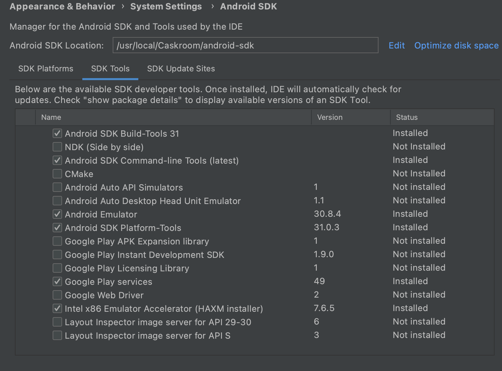

#Spank

Random video chat

##Start Android on Windows / Mac

####Скачать [Android Studio](https://developer.android.com/studio) для использования эмулятора
1. открыть проект Spank 
2. *File* -> *Project Structure* -> *SDKs* -> если Android SDK еще не добавлена, то *+* -> *Add Android SDK* -> в поле *Android SDK Home Path:*  
    > Windows: C:\Users\\{username}\AppData\Local\Android\sdk 
    > 
    >Mac: /Users/{username}/Library/Android/sdk
3. установить переменную окружения *ANDROID_HOME* с указание пути до SDK 
3. в верхней строке *Edit Configuration* -> *Add new configuration* -> *Android App* -> *Apply*
4. *Tools* -> *Android* -> *AVD Manager* -> *+ Create Virtual Device* -> выбрать устройство -> *next* -> скачать необходимую Android версию -> *next* -> *finish* 
5. теперь эмулятор можно запустить -> зеленый треугольник (Launch this AVD in the emulator) -> в отдельном окне запустится эмулятор

####Скачать [IntelliJ IDEA](https://www.jetbrains.com/ru-ru/idea/download) в ней ведется разработка кода
1. открыть проект Spank 
2. *InteliJ Idea* -> *Preferences* -> *Appearance & Behavior* -> *System Settings* -> *Android SDK* -> проверить что путь до SDK указан (возможно придется еще и в IDEA скачать Android SDK) -> *SDK Tools* -> установить необходимые пакеты со скриншота

3. установить java JDK по [инструкции](https://docs.oracle.com/en/java/javase/11/install/installation-jdk-microsoft-windows-platforms.html#GUID-96EB3876-8C7A-4A25-9F3A-A2983FEC016A) 
4. *File* -> *Project Structure* -> *SDKs* -> проверить что JDK установлена или указать путь до JDK из переменной *HOME_PATH*, которая была указана в инструкции
5. установить [Node.js](https://nodejs.org/en/)
6. в cmd установить react-native в директории проекта
    >npm install -g react-native-cli
                                                         
    >npm install                                                     
                                                         
    >react-native eject                                                      
7. может потребовать принять все лицензии Android, для этого скачать [flutter doctor](https://flutter.dev/docs/get-started/install/windows)                                                                                                                                                                                                                                                                                      
    >flutter doctor -v  
    
    >flutter doctor --android-licenses
8. запускаем приложение через cmd с указанием порта (так как 8081 бывает занят антивирусом), если запуск пройдет без ошибок, то приложение откроется в эмуляторе  - если есть проблемы, то задать вопросы можно *esinaekwork@gmail.com*
    >react-native run-android --port=9900                                                                                                                                                                                                                                                                                                                                                                                                       

##Start IOS on Mac
####Скачать [IntelliJ IDEA](https://www.jetbrains.com/ru-ru/idea/download) в ней ведется разработка кода
1. открыть проект Spank 
2. устанавлием brew через terminal
    >/bin/bash -c "$(curl -fsSL https://raw.githubusercontent.com/Homebrew/install/HEAD/install.sh)"
3. устанавливаеем JDK11, react-native и прочие необходимые тулы
    >brew install node
                                                                   
    >brew install watchman                                                               
                                                                   
    >brew install adoptopenjdk11                                                               
                                                                                                                                                                                                                                                                                                                            
    >npm install -g react-native-cli                                                                                                                                                                                                                                                                                                                        
                                                                                                                                                                                                                                                                                                                                                                                                                                                                                                                                                                                                                                                                                                                                                         
    >sudo gem install cocoapods                                                                                                                                                                                                                                                                                                                                                                                                                                                                                                                                                                                                                                                                                                                                                     
              
4. установить flutter doctor по [инструкции](https://flutter.dev/docs/get-started/install/macos)                                                                                                                                                                                                                                                                                                                                                                                                                                                                                                                                                                                                                                                                                                                                                                                                                                                                                                                                                                                                                                                                                                                                                                                                                                                                                                                                                                                                                                                                                                                                                                                                                                                                                                                                                                                                                                                                             
5. *File* -> *Project Structure* -> *SDKs* -> если java SDK еще не отображается, то добавляем и указываем путь 
    > /Library/Java/JavaVirtualMachines/adoptopenjdk-11.jdk/Contents/Home                                                                                                                  
6. в директории проекта в terminal - генерируем папку *node_modules* 
    >npm install
    
    >react-native eject 
                                                                                                                                            
    >cd ios
    
    >pod install
    
    >npm run build:ios                                                                                                                                                                                                                                                                                                                                                                                                                                                                                                                                            
7. в terminal запускаем flutter doctor для проверки настройки окружения - если есть проблемы, то задать вопросы можно *esinaekwork@gmail.com*
    >flutter doctor -v  

    >flutter doctor --android-licenses
####Скачать Xcode из App Store для использования эмулятора                                                                                                                                                                                                                                                                              
1. возвращаемся в InteliJ IDEA в директорию проекта, чтобы принять лицензионное соглашение                                                                                                                                                                                                                                                                              
    >sudo xcodebuild -license                                                                         
2. теперь открываем проект в Xcode
    >xed ios
3. настраиваем симулятор (выбрать неоходимый device и скачать версию IOS) по [иструкции](https://developer.apple.com/documentation/xcode/running-your-app-in-the-simulator-or-on-a-device)                                      
4. запускаем эмулятор нажав серый треугольник, success - приложение запущено на эмуляторе

